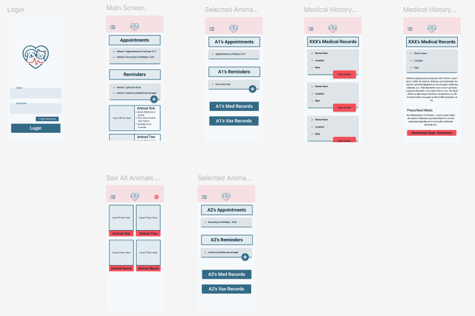

# AD350-PawPrint
**Copper Wilson** 

*AD350 - Database Technology*

### Overview
Create the database schema and backend for the PawPrint app designed in AD351.

PawPrint helps pet owners manage their pets care in one place. Users can add pets, view services, schedule appointments, and track basic pet care records. 

### Core Tables
1. `Owners`
stores the pet owner's information
    - id
    - first_name
    - last_name
    - email
    - phone
2. `pets` stores each pet profile
    - id
    - owner_id
    - name
    - species
    - breed
    - birth_date
    - adoption_date
    - weight
3. `care_records`
    - id
    - pet_id
    - care_record_type_id
    - record_date
    - title
    - description
    - provider_name
    - next_due_date
4. `reminders`
    - id
    - pet_id
    - reminder_title
    - reminder_type_id
    - due_date
    - is_completed
5. `food_logs`
    - id
    - pet_id
    - food_id
    - bag_size
    - start_date
    - end_date
    - notes

### Other Tables
1. `reminder_types` 
    - id
    - type_name
2. `care_record_types`
    - id
    - type_name
3. `foods` to help standardize the DB, so food could be a dropdown
    - id
    - food_brand
    - food_name
    - food_type
    - species
    
    ---

    